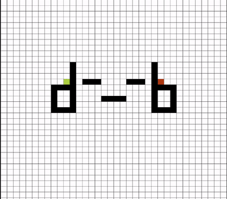

# Search_Visualizotion
Did you ever wonder what would A* and other path finding algortihms look on a square grid? 
If yes that's good 
If no that's still good 

For now there's no async I/O so clicking buttons will have some visible delay
> I'll fix that sometime

## Tutorial
Clicking <kbd>R</kbd> restarts the algorithm only when paused 
Clicking <kbd>R</kbd> when algorithm is reseted clears the grid 
Clicking <kbd>SPACE</kbd> pauses the algorithm 
<kbd>Left Click</kbd> adds (start, end 🟥, wall ⬛) in this order if you delete start it will firstly create a start node 
<kbd>Right Click</kbd> deletes stuff ⬜ 
**Drawing is enabled only when the algorithm has ended 
When there is no solution algorithm restarts**

## Legend
-  EMPTY NODE
-  START NODE
-  END NODE
-  WALL NODE
-  CURRENTLY CHECKED NODE
-  NEIGHBOR NODE BEING ADDED TO OPEN SET
-  NODE IN OPEN SET
-  CHECKED NODE
-  PATH NODE

## Visualization

